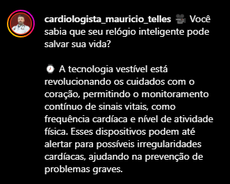
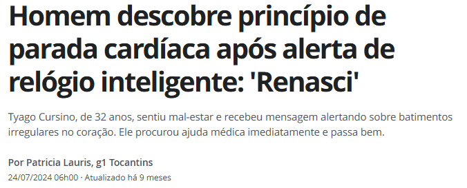

<h1>Chatbot para Chamadas Médicas de Emergência (Alura + Google 05/2025)</h1>

<!-- Sumário -->

  
Sumário

  <a href="#vida-e-precioso" style="text-decoration:none; color:#2a2a72; font-weight:600; padding:5px 10px; border-radius:5px;">💖 A Vida é o Bem Mais Precioso</a>
  <a href="#conheca-o-projeto" style="text-decoration:none; color:#2a2a72; font-weight:600; padding:5px 10px; border-radius:5px;">🎥 Conheça o Projeto</a>
  <a href="#motivacao" style="text-decoration:none; color:#2a2a72; font-weight:600; padding:5px 10px; border-radius:5px;">💡 Motivação do Projeto</a>
  <a href="#impactos-sociedade" style="text-decoration:none; color:#2a2a72; font-weight:600; padding:5px 10px; border-radius:5px;">🌍 Impactos Positivos para a Sociedade</a>
  <a href="#como-funciona" style="text-decoration:none; color:#2a2a72; font-weight:600; padding:5px 10px; border-radius:5px;">⚙️ Como Funciona (Simulação no Google Colab)</a>
  <a href="#interface-de-testes" style="text-decoration:none; color:#2a2a72; font-weight:600; padding:5px 10px; border-radius:5px;">🖥️ Interface de testes Mobile</a>
  <a href="#tecnologias" style="text-decoration:none; color:#2a2a72; font-weight:600; padding:5px 10px; border-radius:5px;">🛠️ Tecnologias Utilizadas</a>
  <a href="#proximos-passos" style="text-decoration:none; color:#2a2a72; font-weight:600; padding:5px 10px; border-radius:5px;">🚀 Próximos Passos</a>
  <a href="#aviso-importante" style="text-decoration:none; color:#2a2a72; font-weight:600; padding:5px 10px; border-radius:5px;">⚠️ Aviso Importante</a>

<h2 id="vida-e-precioso">💖 A Vida é o Bem Mais Precioso</h2>
  
<strong>🌍 A vida é o bem mais precioso que possuímos.</strong> E quando cada segundo pode significar a diferença entre a vida e a morte, qualquer ferramenta que contribua para salvar uma vida merece atenção. Este projeto é um tributo à tecnologia a serviço do ser humano – simples, funcional e com potencial real de impacto. 
    Em apenas 1 minuto, esse chatbot disponibiliza botão para acionar o SAMU, acionando o contato de emergência e enviando a geolocalização da pessoa que está precisando de ajuda.

   <h2 id="conheca-o-projeto">🎥 Conheça o Projeto</a></h2> 
<a href="https://youtu.be/PmldZKEd7xc" target="_blank" style="text-decoration:none; color:#2a2a72; font-weight:600; padding:5px 10px; border-radius:5px;">▶️ Ver Vídeo</a>
  

   <h2 id="motivacao">💡 Motivação do Projeto</h2>
    

        
    
      

    
O projeto surgiu da inspiração de dois eventos de AVC ocorridos com o meu pai. Este protótipo, portanto, surgiu do desejo de criar uma solução prática e acessível que auxilie nos momentos mais críticos: as emergências. Inspirado por casos como o Acidente Vascular Cerebral (AVC), que tira mais de <strong>6,5 milhões de vidas por ano (Ministério da Saúde)</strong>, este chatbot simula um sistema de triagem digital, capaz de:

    <ul>
      <li>Identificar sinais de emergência em segundos</li>
      <li>Simular o acionamento do SAMU (192)</li>
      <li>Notificar automaticamente um contato de emergência</li>
    </ul>
  

  

<h2 id="impactos-sociedade">🌍 Impactos Positivos para a Sociedade</h2>
  
Este projeto vai além da tecnologia. Ele representa uma ponte entre <strong>acessibilidade, prevenção e empatia</strong> — valores fundamentais quando o tema é salvar vidas. Seus impactos incluem:

  <ul>
    <li><strong>📉 Redução do tempo de resposta:</strong> Ao simular o atendimento e orientar ações rápidas, pode ajudar a mitigar sequelas graves ou até mesmo evitar óbitos.</li>
    <li><strong>🧘 Apoio emocional em situações críticas:</strong> Oferecer instruções claras e objetivas pode reduzir o pânico e aumentar a confiança de quem está ajudando ou vivenciando a emergência.</li>
    <li><strong>🌐 Democratização do acesso:</strong> Pessoas em regiões com pouca infraestrutura ou suporte médico podem ter uma ferramenta inicial de triagem digital.</li>
    <li><strong>♿ Inclusão digital:</strong> Este chatbot pode futuramente ser adaptado para acessibilidade com áudio, Libras ou leitura automática, atendendo públicos com deficiência visual ou auditiva.</li>
    <li><strong>👨‍👩‍👧 Educação preventiva:</strong> Ao usar o simulador, mais pessoas aprendem a reconhecer sintomas de emergências comuns como AVC, infarto ou parada respiratória.</li>
    <li><strong>🤝 Engajamento comunitário:</strong> Pode ser usado em campanhas de saúde, escolas e ONGs para conscientização sobre primeiros socorros e importância do atendimento rápido.</li>
  </ul>
  
Em um mundo onde o tempo é vital, cada segundo poupado pode significar uma história diferente — uma vida preservada, uma família amparada, uma sociedade mais preparada.

  

    <h2>⚠️ Necessidade Identificada</h2>
    
Em situações emergenciais, o pânico pode comprometer a ação. Este chatbot visa:

    <ul>
      <li><strong>Guiar o usuário</strong> com perguntas objetivas</li>
      <li><strong>Agilizar o contato</strong> com serviços de emergência</li>
      <li><strong>Notificar terceiros</strong> com informações úteis e localização</li>
    </ul>
  

  

  <h2 id="como-funciona">⚙️ Como Funciona (Simulação no Google Colab)</h2>
    <ol>
      <li><strong>👤 Identificação:</strong> pergunta o nome do paciente</li>
      <li><strong>🚑 Triagem:</strong> 3 perguntas para avaliar a urgência</li>
      <li><strong>📞 Acionamento do SAMU (simulado):</strong> link visual de chamada</li>
      <li><strong>🔔 Notificação a contato de emergência:</strong> coleta e formata os dados</li>
      <li><strong>ℹ️ Informações adicionais:</strong> link para documentação futura</li>
      <li><strong>🏁 Fim da simulação:</strong> reforça instruções reais</li>
    </ol>
  

  <h2 id="tecnologias">🖥️ Interface de testes Mobile</h2>

Partiu HANDS-ON? Teste você mesmo na interface para Mobile clicando [aqui](https://sites.google.com/view/chatbot-chamadas-emergencia/inicio).

  

  

   <h2 id="tecnologias">🛠️ Tecnologias Utilizadas</h2>
    <ul>
      <li><strong>Python:</strong> A linguagem de programação fundamental em que o chatbot foi desenvolvido.</li>
      <li><strong>Google Colab:</strong> O ambiente online do Google no qual o código Python foi executado.</li>
      <li><strong>IPython.display:</strong> Especificamente o módulo HTML dentro dele, usado para exibir o botão de emergência como um link HTML interativo no Colab.</li>
      <li><strong>urllib.parse:</strong> Utilizado para formatar o endereço fornecido pelo usuário para criar o link do Google Maps na mensagem de emergência simulada.</li>
      <li><strong>time:</strong> O módulo usado para introduzir as pausas de alguns segundos durante a interação do chatbot, tornando a simulação mais fluida.</li>
    </ul>
  

  

    <h2 id="proximos-passos">🚀 Próximos Passos</h2>
    <ul>
      <li>📱 Interface amigável para mobile</li>
      <li>💬 Integração com APIs de mensagem Twilio, WhatsApp</li>
      <li>📍 Geolocalização precisa (via GPS)</li>
      <li>🗄️ Armazenamento seguro em banco de dados</li>
      <li>🔐 Conformidade com a LGPD</li>
      <li>🧠 Uso de NLU para conversas naturais</li>
      <li>🧪 Testes com usuários em múltiplos cenários</li>
    </ul>
  

  

    <h2 id="aviso-importante">⚠️ Aviso Importante</h2>
    
Este é um <strong>protótipo educacional</strong>. Em emergências reais, contate imediatamente os serviços oficiais:

    <ul>
      <li><strong>SAMU:</strong> 192</li>
      <li><strong>Bombeiros:</strong> 193</li>
      <li><strong>Polícia:</strong> 190</li>
    </ul>
  

## 👤 SOBRE A AUTORA / CONTATO

Este projeto foi desenvolvido por MONIQUE VETTORATO (Analista de Dados).

* **LinkedIn:** [LinkedIn](https://www.linkedin.com/in/monique-vettorato/)
* **E-mail:** [E-mail](mailto:monique.vettorato@gmail.com)
* **Telefone:** [WhatsApp](https://wa.me/5551999374894)
* **Portfólio de Dashboards:** [Portfólio](https://sites.google.com/view/projetosdebi-moniquevettorato/inicio)
  </body>
</html>
